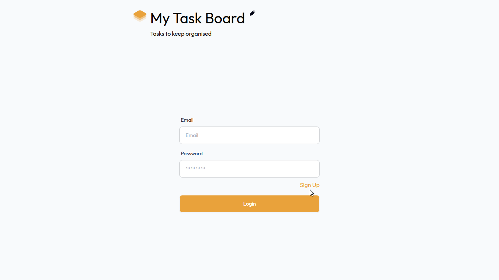
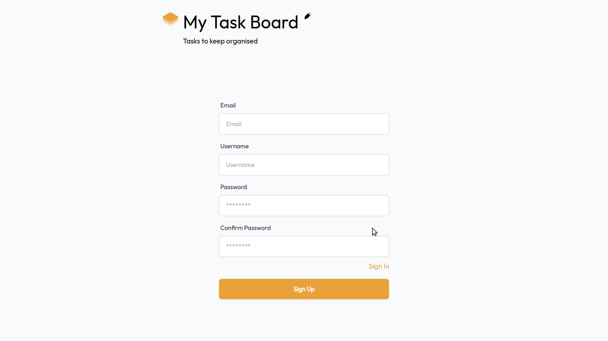
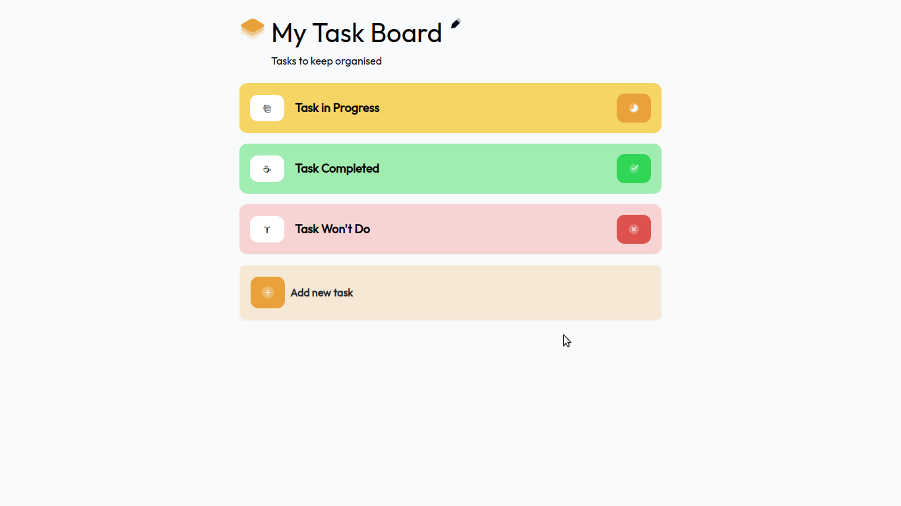
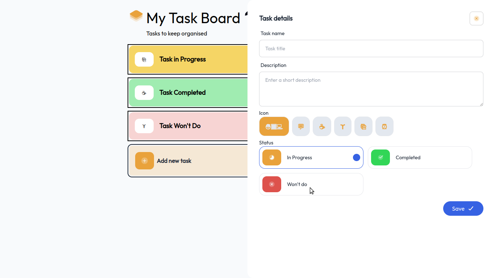
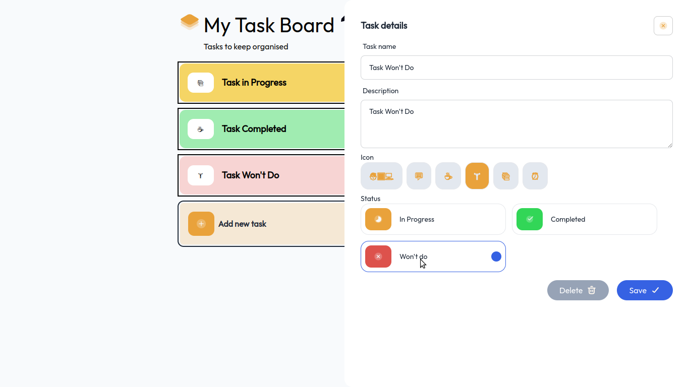

<p align="center">
   <a href="https://www.linkedin.com/in/arilsonsouza/">
      
   </a>

  
</p>

> Este é um desafio Full Stack da plataforma [devChallenges](https://devchallenges.io/challenge/my-task-board-app). Fiz um projeto um pouco diferente dos requisitos. Implementado cadastro e login de usuários em uma API rest desenvolvida com Spring Boot. A implantação da API foi feita utilizando doker na plataforma Render. No front end utilizei ReactJs, Vite, Daisyui e Tailwindcss.

Devido a utilização de recursos gratuitos para deploy o primeiro acesso a aplicação deve demorar um pouco.

# :pushpin: Conteúdo

- [Tecnologias](#computer_tecnologias)
- [Executando](#construction_worker-executando)
- [Screenshots](#construction_screenshots)

# :computer: Tecnologias

Este projeto foi feito utilizando as seguintes tecnologias:

- [Spring Boot](https://spring.io/projects/spring-boot)
- [React](https://reactjs.org/)
- [Typescript](https://www.typescriptlang.org/)
- [Vite](https://vitejs.dev/)
# :construction_worker: Executando

```bash
# Clone o Repositório
https://github.com/arilsonsouza/task-board.git
```
Renomeie o arquivo `.env.local.example` para `.env.local`.

```
$ cd frontend
```
```bash
# Baixe as dependendências
$ yarn
```

```bash
# Execute
$ yarn dev
```

Para executar o backend basta executar os seguintes passo:
```
$ cd backend
```
```
$ docker compose up
```
Agora é só executar a classe `TaskBoardApplication`

Acesse <http://localhost:3000> para ver o resultado.

# :camera: Screenshots






Criando uma imagem docker
- Faça login na plataforma em que pretende hospedar sua imagem docker.
- Altere a propriedade `image` no `pom.xml`, colocando seu nome de usuário.

```shell
export SPRING_PROFILES_ACTIVE=docker
export DATABASE_URL=jdbc:postgresql://localhost:5432/task_board
export DATABASE_USER=postgres
export DATABASE_PASSWORD=postgres
export JWT_SECRET=hqS6RGmay6URl00U01CZEad1wD/2dTQA/FQBwfYlDe2jDBCc7Wp7dPQGDkm/YEh+
```

```shell
mvn clean package -P build-docker-image
```
